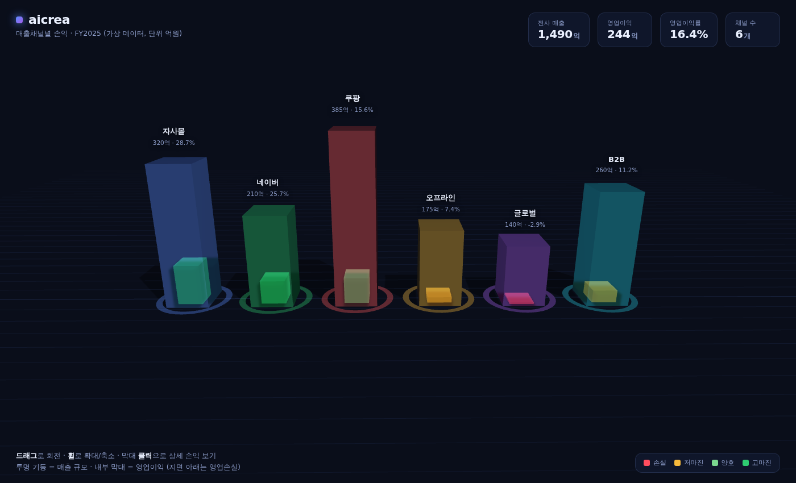

# aicrea · 매출채널별 손익 3D 대시보드 (Android 앱)

[three.js](https://threejs.org) 기반의 3D 인터랙티브 화면을 **안드로이드 앱**으로 띄웁니다.
aicrea의 **매출채널별 손익(P&L) 데이터**(가상/mock)를 3D로 시각화합니다.

앱은 `WebView`(정확히는 `WebViewAssetLoader`) 위에서 웹 결과물(`index.html` + `src/` + `vendor/`)을
그대로 실행합니다. WebGL·ES module·import map 이 모두 정상 동작합니다.



## 무엇을 보여주나

6개 매출채널(자사몰 D2C · 네이버 · 쿠팡 · 오프라인 · 글로벌 · B2B)을
3D 기둥으로 배치합니다.

| 시각 요소 | 의미 |
|---|---|
| 반투명 유리 기둥 높이 | **매출 규모** |
| 내부 솔리드 막대 | **영업이익** (지면 아래로 내려가면 영업손실) |
| 내부 막대 색 | 영업이익률 구간 (손실 🔴 · 저마진 🟡 · 양호 🟢 · 고마진 🟢) |
| 바닥 발광 링 | 채널 아이덴티티 컬러 / 선택 하이라이트 |

### 인터랙션
- **드래그** 회전 · **휠** 확대·축소 (자동 회전은 조작 시 멈춤)
- 막대 **클릭** → 우측 패널에 손익 상세(매출·원가·마케팅·판관비·영업이익·이익률) + **월별 매출 스파크라인**
- `Esc` 또는 ✕ 로 패널 닫기

## 안드로이드 앱 빌드·실행

Android Studio(권장) 또는 명령줄에서 빌드합니다. **Android SDK가 필요**합니다.

### Android Studio
1. 이 저장소 루트 폴더를 `Open` 으로 엽니다.
2. Gradle sync 가 끝나면 ▶︎(Run) — 에뮬레이터/실기기에서 `aicrea 3D` 앱이 실행됩니다.

### 명령줄
```bash
# 디버그 APK 빌드
./gradlew assembleDebug
# 결과물: app/build/outputs/apk/debug/app-debug.apk

# 연결된 기기/에뮬레이터에 바로 설치·실행
./gradlew installDebug
```

- 최소 지원: **Android 7.0 (API 24)** / compileSdk 34 / AGP 8.6 · Gradle 8.9 · JDK 17
- 빌드 시 루트의 웹 결과물(`index.html`, `src/`, `vendor/`)이 `copyWebAssets` 태스크로
  `app/src/main/assets/` 에 자동 복사됩니다. 웹 소스는 **루트 한 곳에서만** 관리하세요.

### 웹으로 미리보기 (선택)
앱 없이 브라우저에서 화면만 확인하려면 정적 서버로 열면 됩니다
(ES module import map 때문에 `file://` 직접 열기는 불가):

```bash
python3 -m http.server 8123   # 또는  npx serve -l 8123 .
```
브라우저에서 <http://localhost:8123> 접속.

## 구조

```
app/                              # 안드로이드 앱 (WebView 래퍼)
  build.gradle                    #  - 웹 자산 복사 태스크 + 의존성(androidx.webkit)
  src/main/AndroidManifest.xml
  src/main/java/.../MainActivity.java   # WebViewAssetLoader 로 assets 서빙
  src/main/res/                   #  - 테마 / 문자열
index.html          # 마크업 · 스타일 · import map · UI 오버레이
src/data.js         # aicrea 매출채널별 손익 데이터(가상) + 파생지표 계산
src/app.js          # three.js 씬 · 막대 생성 · 레이캐스트 상호작용 · 상세 패널
vendor/             # 로컬 번들된 three.js (three.module.js, OrbitControls, CSS2DRenderer)
```

## 데이터 수정

`src/data.js`의 `raw` 배열에서 채널별 `revenue / cogs / marketing / sga`
값만 바꾸면 영업이익·이익률·색상·막대 높이·KPI가 자동으로 재계산됩니다.
실데이터 연동 시 이 파일을 API 응답으로 교체하면 됩니다.

> 데이터는 모두 **가상 예시치**(단위: 억원, FY2025 가정)이며 실제 실적이 아닙니다.
